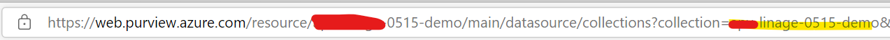
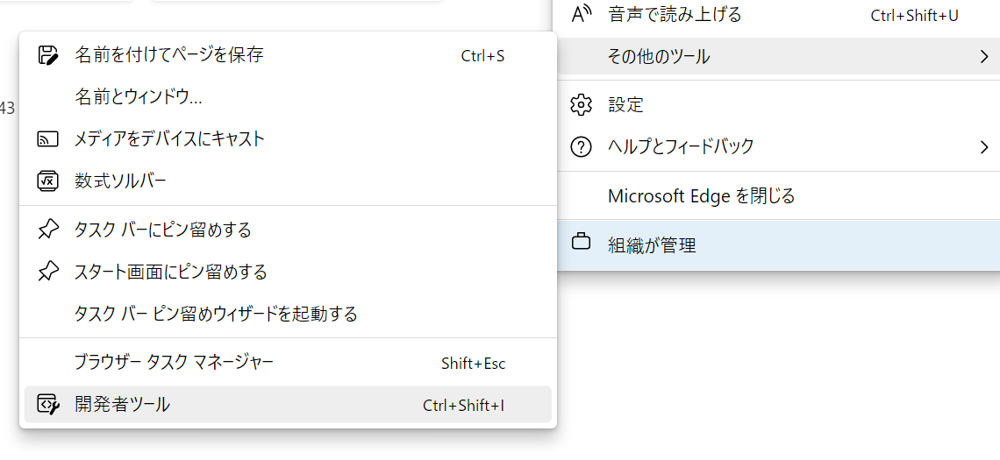
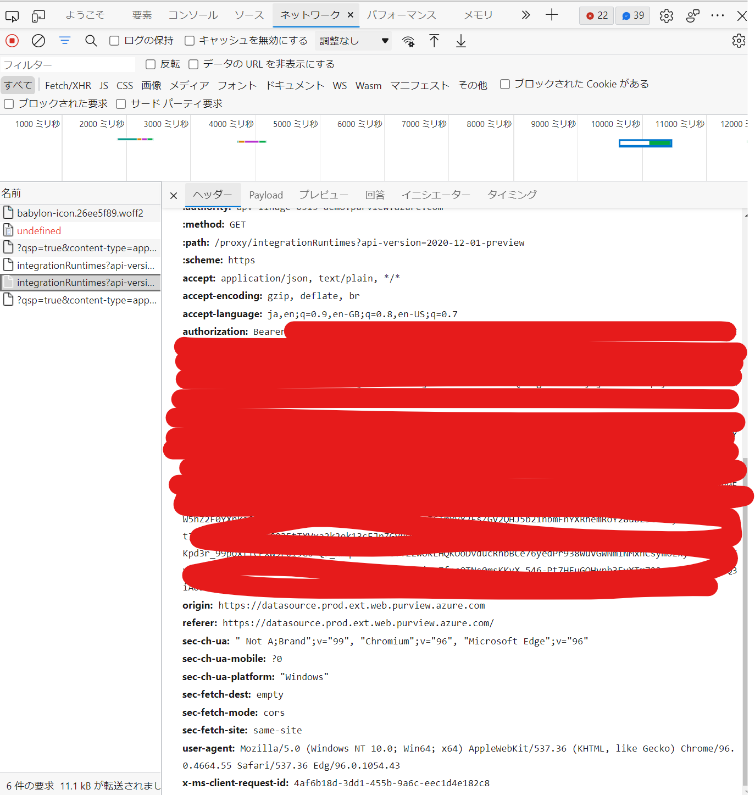

# Delete EntitiesByCollection

## 使用方法

### 1. ソースの取得

git clone 後、移動します。

```bash:bash

cd DeleteEntitiesByCollection

```

### 2. 変数の準備

- purviewAccountName:Purview名
- collectionId:コレクションID

collectionIDの確認方法

[Data Map]>[Collections]>[該当のコレクション]より、
https://web.purview.azure.com/resource/<Purview名>/main/datasource/collections?collection=<コレクションID>
の形式で確認可能です。



### 3. 実行
#### curl.sh

トークンの確認方法

- export token=
ブラウザの開発者ツールを起動します。


purview Studio 上で操作をすると、authorizationより確認可能です。




変数をセットします。

```bash:bash


purviewAccountName=
collectionId=
export token=

```

実行します。

```bash:bash

PURVIEWACCOUNTNAME=$purviewAccountName \
COLLECTIONID=$collectionId \
bash curl.sh

```


#### azrest.sh(未作成)